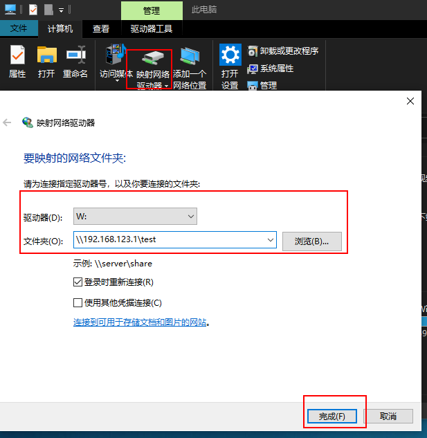

工作中有这样的场景：公司办公主流使用win平台，有在win下建立的共享目录（网络磁盘network drives），但由于习惯使用linux环境（或服务搭建在linux环境上），在win服务器下[开启了wsl](https://blog.csdn.net/yushuzhen2008/article/details/104944579)，固产生了在linux下挂载win下的 network drives的需求。

# 1. 在win下映射网络驱动器
在我的电脑->计算机 下 映射网络驱动器:


# 2. 在wsl中挂载
简要步骤：[How to Mount Windows Network Drives in WSL](https://www.public-health.uiowa.edu/it/support/kb48568/)

报错修复：[Windows下网络共享文件夹挂载到wsl系统](https://blog.csdn.net/The_Time_Runner/article/details/108555884)

安装文件系统支持：
```
sudo apt-get update # 如不update，后续安装cifs可能报错
sudo apt-get install cifs-utils
```

创建挂载锚点：
```
mkdir /mnt/w
```

创建挂载：
```
# sudo mount -t drvfs //server/directory /mnt/w
sudo mount -t drvfs W: /mnt/w
```

永久生效（启动后即生效）：
`sudo vi /etc/fstab`添加新一行
```
W: /mnt/w drvfs defaults 0 0
```
重新加载`sudo mount -a`


至此挂载搞定，可像普通目录一样访问：
```
ls /mnt/w
```