<iframe frameborder="no" border="0" marginwidth="0" marginheight="0" width=330 height=86 src="//music.163.com/outchain/player?type=2&id=27901832&auto=1&height=66"></iframe>

五一假期福建兄弟结婚，跑去参加，没想到返程的时候赶上了超大面积的延误，心中一冲动，上演了夸城市赶飞机的神操作。╮(￣▽￣)╭

# 1. 去福建
春节期间北京不让回乡，有接近一年没回内蒙，所以很早就确定五一回家。但婚礼8号在泉州，所以确定了直接从呼和浩特飞泉州的方案。因为呼和浩特飞晋江机场的没有直飞，中间要经停长沙，耗时较长，到达较晚，赶不上晚餐，所以买了呼和浩特直接到厦门高崎的飞机，准备从高崎打车到北站，再接驳高铁到泉州站。方案如下（当时没有留截图的都用现在的替代）：

呼和浩特直接到泉州：
<!-- 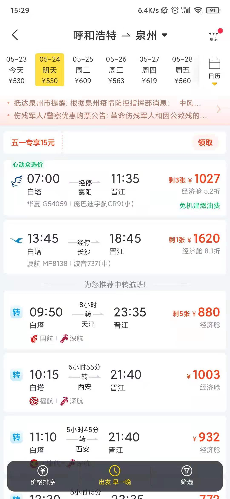{:height="100" width="200"} -->

（晋江机场到丰泽区的目的地还有半小时车程）

呼和浩特到厦门再火车到泉州：

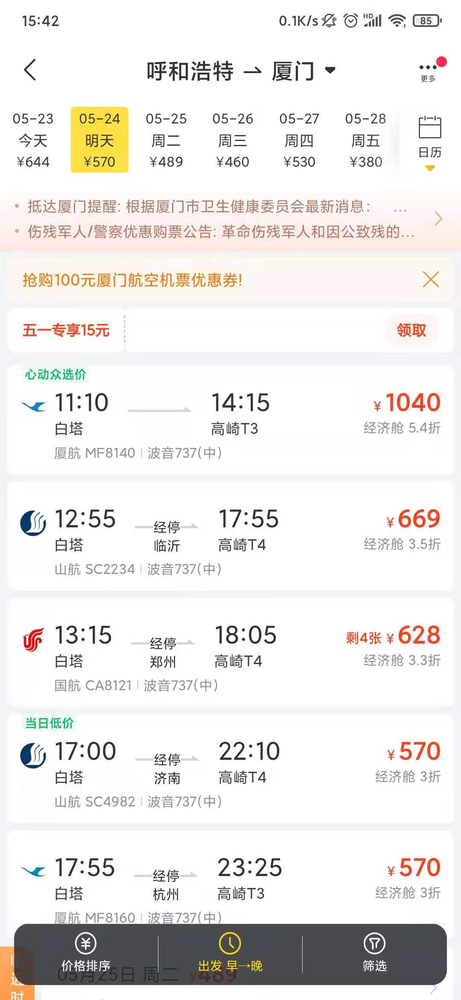
<!--  -->

2点多就到厦门了，再打车到厦门北站半小时，动车25分钟到泉州站，算上中间的等待、接驳时间 2小时内搞定。下午4点就能到泉州。

tip1:从厦门机场打车到厦门站和厦门北站的时间差不多，但由于厦门站在岛内，由厦门站出发到泉州的火车要多走15分钟的。因此打车到北站速度更快

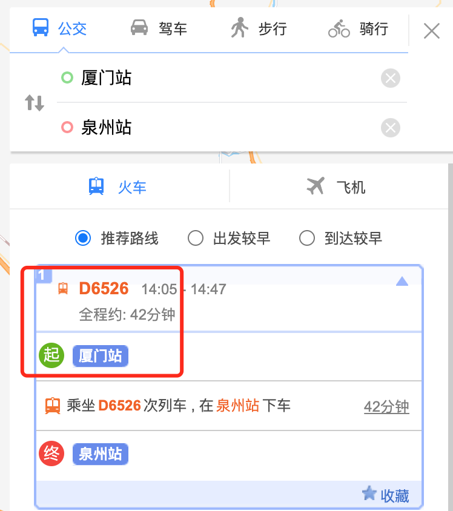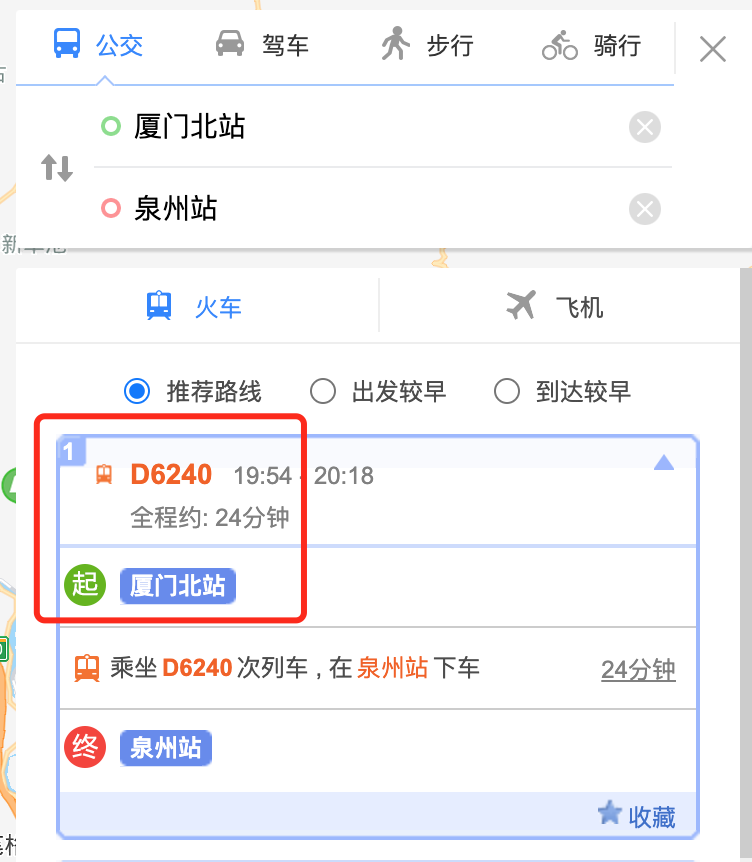
<!--  -->
tip2:由于距离近，票价低，在12306中很容易就够积分可以兑换车票

另外价格上看具体哪天会有区别，我当时飞到泉州是1100，飞到厦门市800（机票+40打车，高铁积分），还便宜了一点。这不重要，关键的还是能赶上晚饭。

实际上也很顺利，完全按计划到达，还改签提前了一班动车早到了一会儿。完美的开始！\（￣︶￣）/

# 2. 准备回家
婚礼的过程就不细讲了，总之很热闹，流程也很复杂。大体上还是全国通用的环节为主的。兄弟们还是有点牛逼，走在第二套房、第二辆车、还有二胎的路上，我就以吃吃喝喝为主。有机会再单独写一篇。

雨后景色：
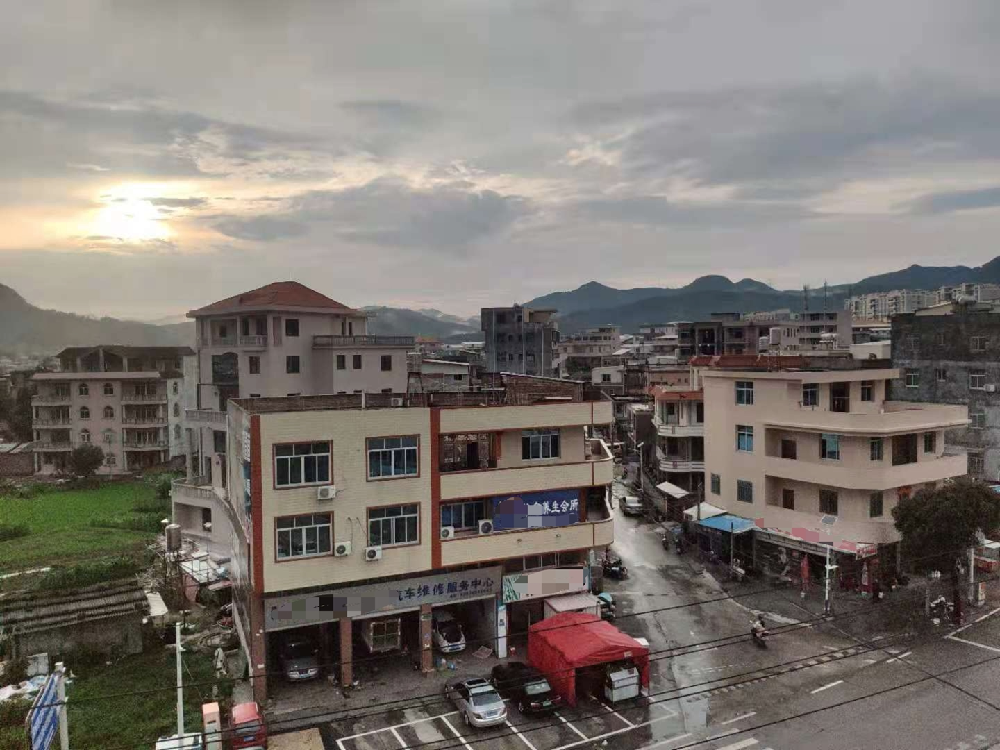

婚礼结束第二天准备回北京，我是下午4点20晋江机场起飞。兄弟上午晋江回国际庄，10点飞机，1点已经准时到达了。我提前4个小时到了机场，一点都不慌，还寄存了行李，在晋江逛起来。

晋江的城市面貌非常新，非常整洁，沿江看到了大量的新盘：
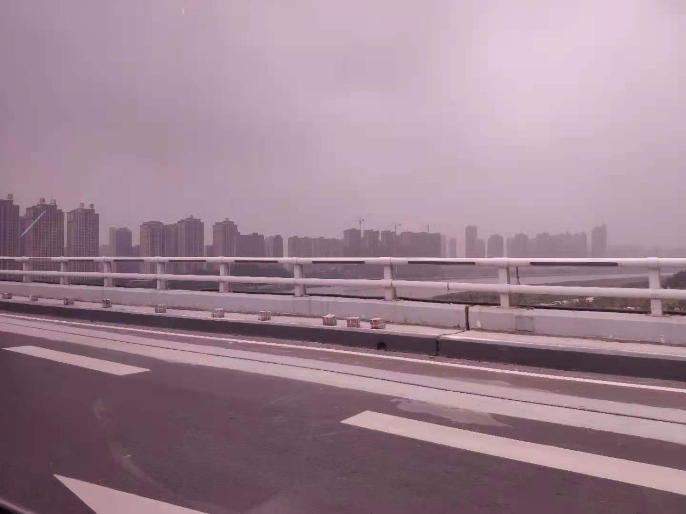

当然要也吃一吃了

铭辉沙嗲面：
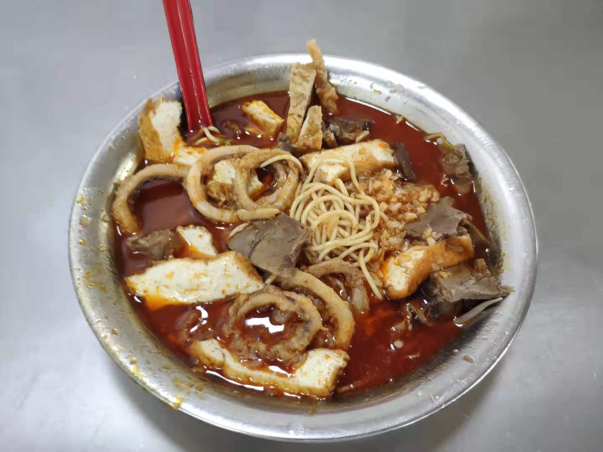

小怣[yóu]面线糊：

打车来了五店市，定位类似南锣鼓巷，里面都是红砖建筑群+祠堂+商业：

真的的名门望族，族里中进士的只能挂在主殿外面：

汉服小姐姐：

小朋友们的活动：

周边的房子也非常新，五店市对面的万达华府，要2.5万一平的，周边环境，交通，商超之类的一应俱全，就容积率有点大，对当地盆友来说应该是不错的选择了吧：

逛一逛，很快时间差不多了，打车很快就回到机场了。没想到真正刺激的还在后面。(*ﾟДﾟ*) 

# 3. 延误5小时+
## 3.1 被动托运行李 
取完行李，准备检票候机，这时候检票的小哥拦住我叫我托运行李。

“这一班飞机的乘客非常多，有可能放不下，建议您办理托运。”

真是头一次遇到这样要求的。我行李箱专门准备的24寸能登机的尺寸啊。要是登机迟到了咋办。

“现在去时间足够，更何况飞机预计会有延误的”

行吧行吧。反正这边机场的神操作已经不是第一次了。刚刚我来打印登机牌的时候，还有驻机场的深航员工，要给我开深航凤凰会员积分卡。我想着积分还行吧，结果拿我的手机过去，微信、支付宝一通操作，给我开了中信银行的信用卡？我问怎么回事，说是不花钱，开的是电子卡，收到实体卡后不开通就行。那也提前要给用户说清楚啊，真的是。最后经理加我微信，承诺我可以注销，加上我要去逛，就先这样了。

总之办完了托运，顺利安检进去了。

黄马甲的阿姨团，他们是去浙江的：

## 3.2 天津之殇
这里得补充说明一下，当时买返程机票的时候，泉州到北京的机票其实挺多的，但是时间合适的都是去大兴机场。我觉得去大兴太远了，感觉和去天津机场差不多时间（但其实因为跨城+高铁衔接，除了时间有差，还有其他因素也得考虑），所以也看了飞天津机场的航班。青岛航空有一班去天津的航班，只需要600块，基本相当于5折，且时间也合适是下午4点20起飞，6点多到天津。这样对比起来，路上最多多花一小时，节省一半钱，看起来还行，就买了。

(时间示意图，实际有偏差)

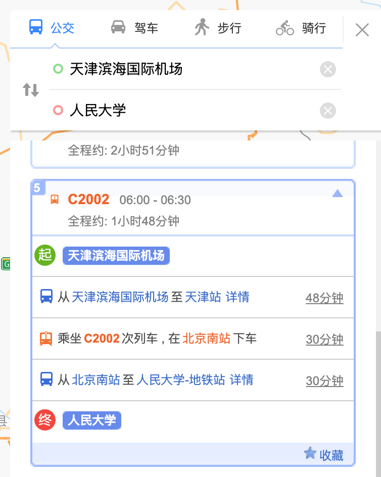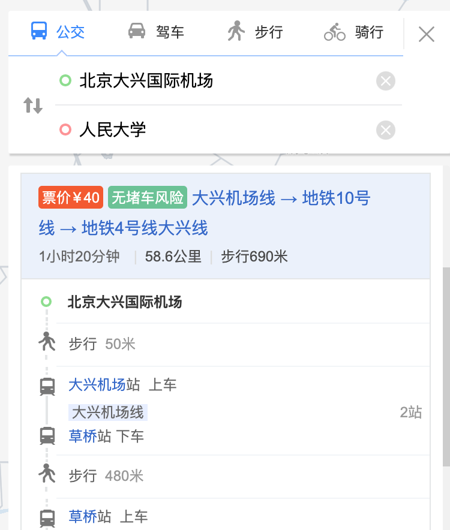

其实这就是类似来的时候去厦门的操作，常规操作了。然而就是这个操作埋下了隐患。

毕竟谁能想到飞机能延误5个多小时，赶不上最后一班城际呢？？？(〒︿〒)

所以安检进去后，就开心的坐在登记口附近后，手机拿出来，开刷等回家了。

## 3.3 情况持续恶化
不一会儿就听到播报，去成都的飞机延误了。看外面的天气，阴天，好像要下雨。问了一下旁边去成都的姐姐，已经延误了1个半小时。心中已有些疑虑，但总体感觉还好。

不一会儿，外面天气阴了，下起了暴雨。心中已渐渐觉得不对劲(*ﾟДﾟ*) 

不到5点的时候，旁边成都的姐姐登机了，我起来去看看情况。

？？？流量控制？？？这个原因感觉不是很可控啊

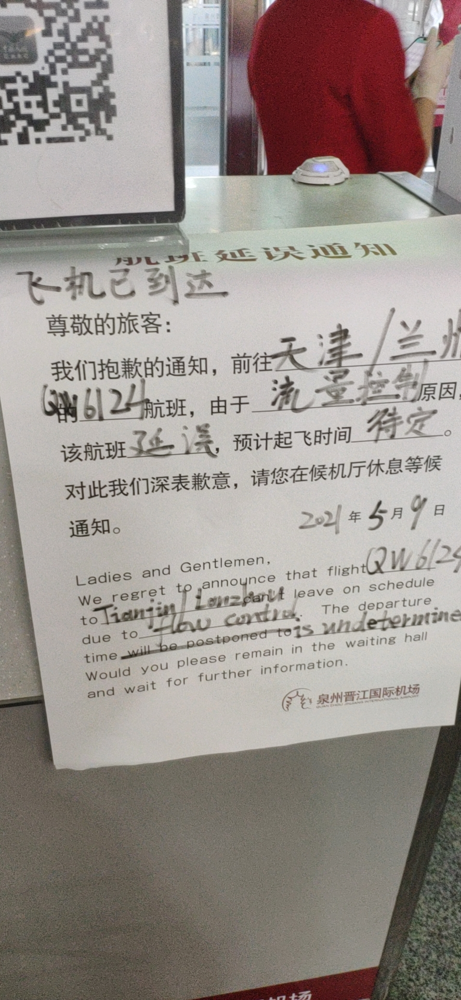

机场开始播报更多的延误信息。同时航旅纵横上已经提示大面积延误了。看看这刺激的画面：

这时候心态已经不稳了，准备买最晚一班从天津回北京的高铁，出发时间大概在11点。还好还有，能赶上回家睡觉。

一会儿回到做的地方，对面的大哥攀谈起来：

“以前坐青岛航空的飞机，从来都没有不延误的。而且每次延误，起飞的优先级都是相当靠后，别人延误2小时，他就能延误3小时，今天这情况不容乐观啊”

ﾉ)ﾟДﾟ(  

果不其然，预计起飞时间从5点半改到7点半了，空姐开始发晚饭了：

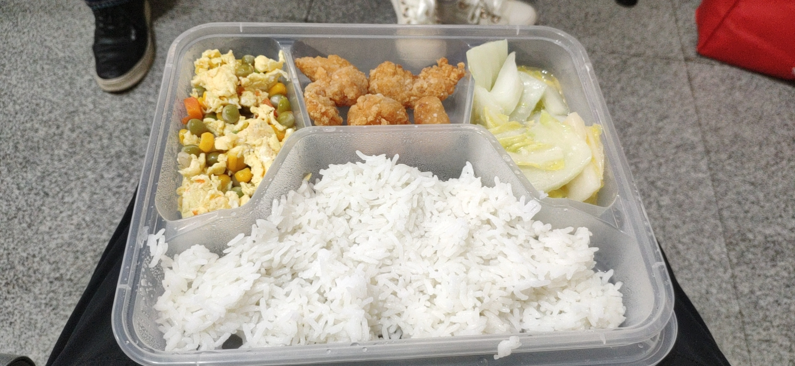

就这水平，不知道能有5块钱成本吗？

7点半起飞到天津10点多，刚刚能够赶上高铁。就勉强还行。但是没想到他又延误了，预计起飞是

# 3. 下定决心
但是他又又又延误了，预计起飞时间9:30!!! 评论区已经有小伙伴发言了：

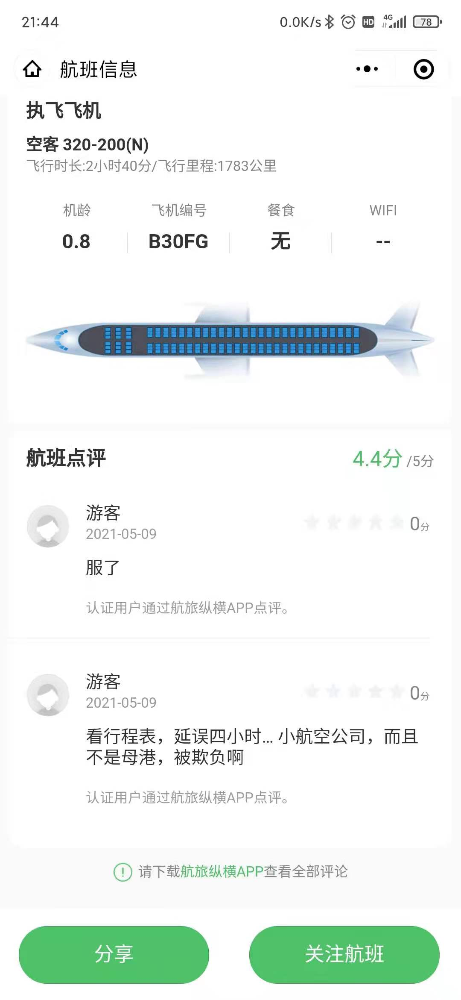

but兄弟，4点20到9点30，那是5个小时。

这12点多到天津也没车了去北京了啊，弄不好只能天津住一晚，第二天回了。还好，睡完觉早上城际回去，上班也不耽误。

但是我还是错误的估计了跨城通勤的人数。第二天早上的高铁票居然只能买到10点多的了！！那我上午还去什么公司，上什么班！那这不是天津尴住一晚，还一样得请假！那这图啥呢，不如直接回了北京，就算晚点也能回家睡得舒服！

哎正在后悔取到天津的决定之时，家属来了一张截图：

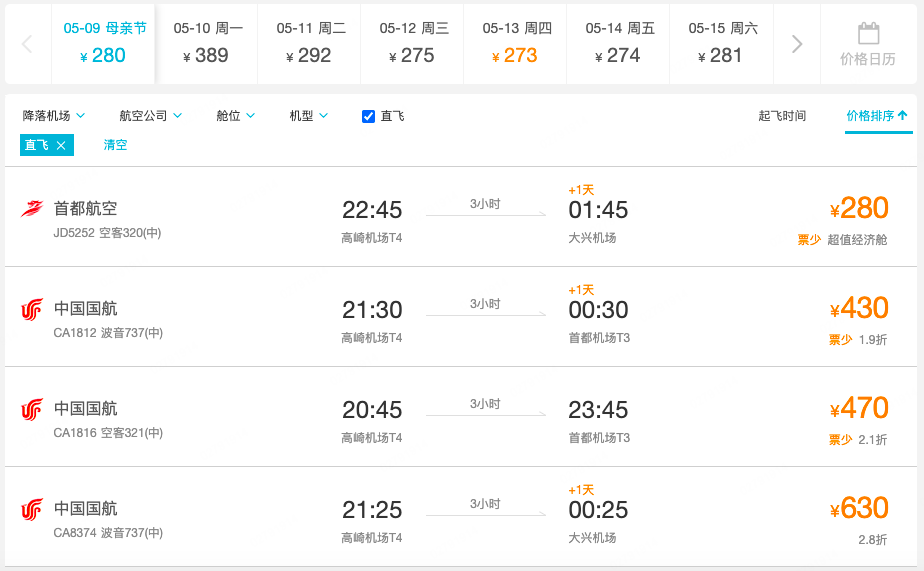

一样的9点半，即使厦门延误一下出发晚一点，但我能回到北京回家睡觉啊！速度研究方案─=≡Σ(((つ•̀ω•́)つ

现在刚过7点。高铁不太完美，只能敢最后一班。中间还得等很久：

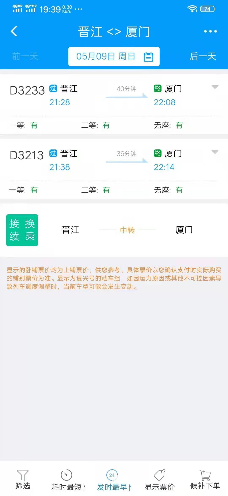

那就直接打车干，1小时多，理论上能赶上：

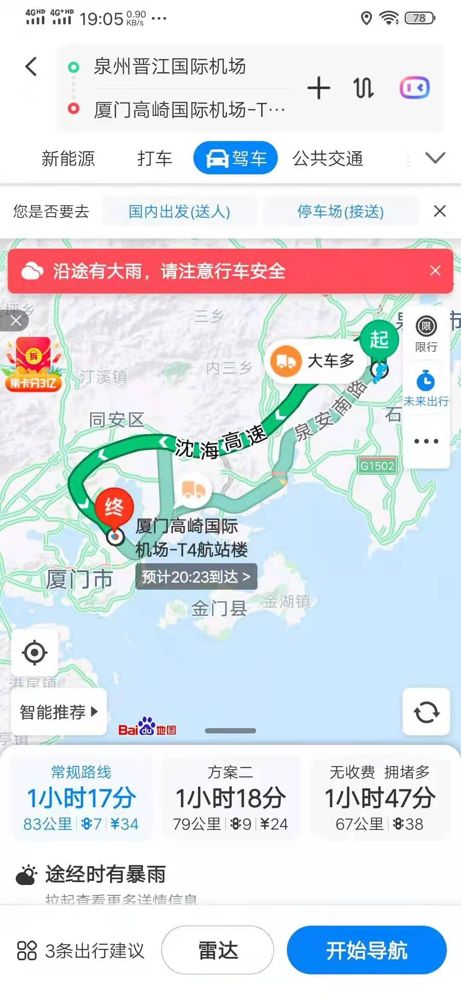

即使赶不上9点半的飞机，还能11点的去大兴，有兜底。

一股热血涌上大脑，说干就干，扭头就走。“惊险之旅”开始

# 4. 惊险之旅
从安检口旁边出去，这下没有回头路了。赶紧找托运小哥拿行李。结果给我说行李刚运走，取回得等会儿。┐(ﾟ～ﾟ)┌ 这伏笔。万一要取一个小时，那不是凉了吗。打车也不敢打，打到了如果没法马上出发，万一单子被取消就麻烦了。

还好十几分钟行李就拿到了。在等待的过程中网上办理了全额退票。第一步略有差错，但时间还有。

快车，出租车，跨城拼车同时呼叫起来。等待的过程中非常焦急，在门口等待的人群中问了一会儿有没有人打车去厦门机场，试图找到同行的人，更快发车。还好在7点半一过，打到了。

师傅一路上稳中求快，争取比导航抢个10分钟。我在车上做出判断，认为要拼一下敢9点半的飞机，不直接选择10点45（厦门也在延误，所以相信能赶上） 当即买票：

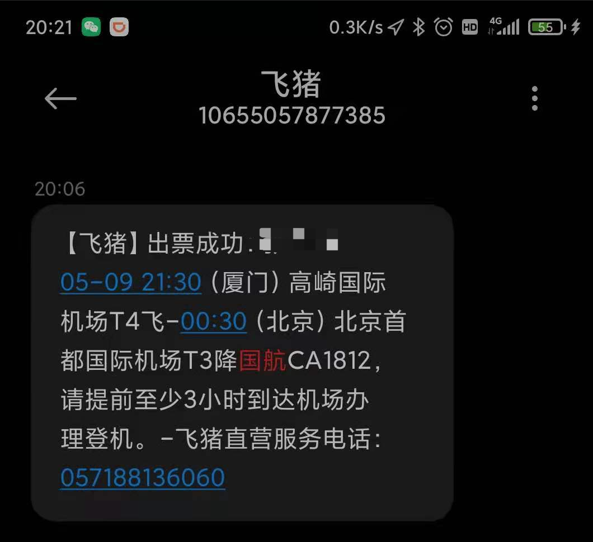

这时家属又来提醒，办理值机的时间一般会提前，如果未完成值机，就算飞机延误，还没飞，也可能进不去：

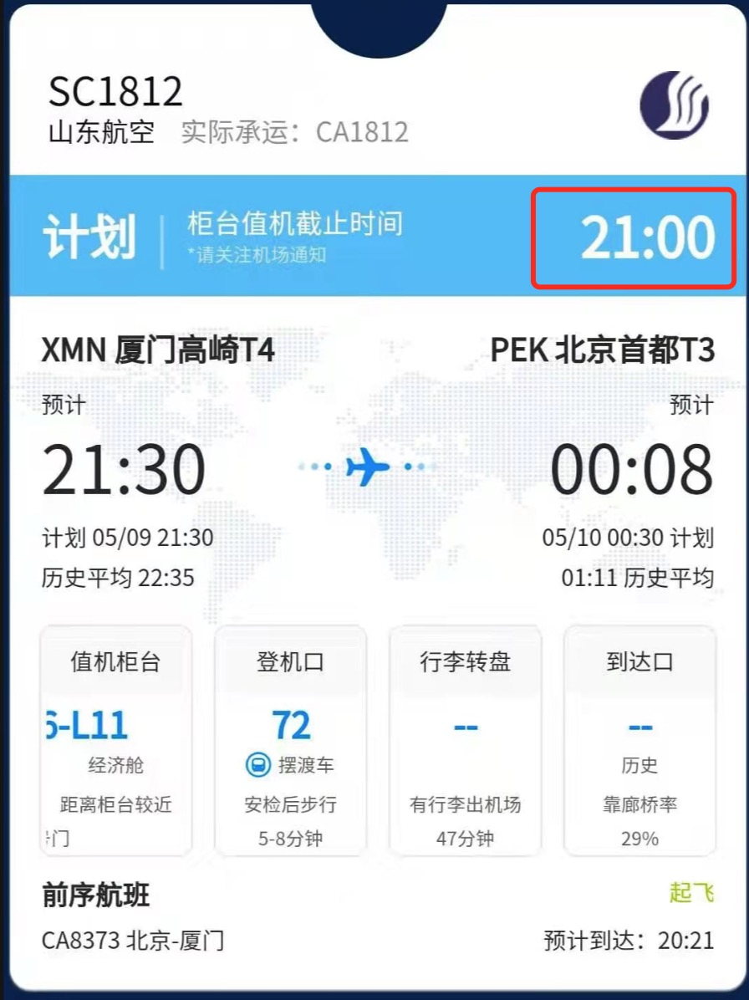

好家伙！差点出错赶不上，还好此时家属也提醒，可采用国航官网或小程序等形式做线上值机，现场可以直接安检。太好了！搞定

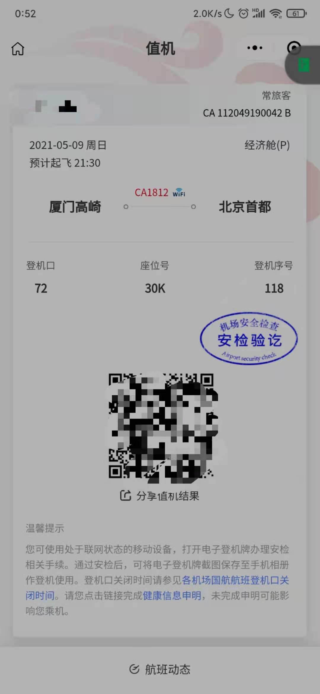

到此主要的任务已经完成，后续只出现了一些小插曲：

泉州的师傅去了厦门机场，不知道怎么送客，走了本地送客出租车入口，结果没进去多绕了一圈。

为了保险起见打登记牌，但自助机提示已经超时，后来去柜台办理成功，中间差点丢了身份证。

总之最后成功安检进来了！！

# 5. 回家
当然，飞机还是延误了一个多小时，我也安安静静的等着。不过谁能想到我是从泉州过来赶飞机的呢┐(ﾟ～ﾟ)┌

不到点2点，飞机降落在首都机场。打车，回家！

（机场里面是真的远，走了20分钟才到停车场）

等到家收拾一下，请假打好招呼，3点钟准时上传睡觉！紧张刺激的回家之旅终于结束了！完结撒花ヾ(^▽^ヾ)