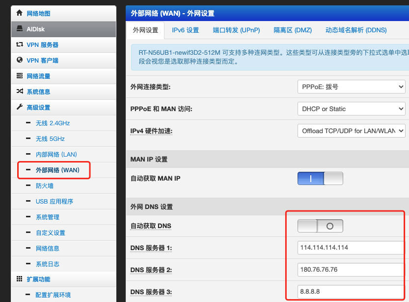
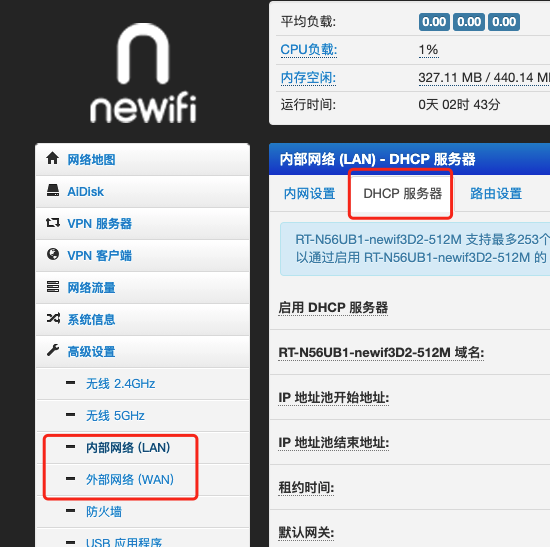

最近在家卧床休息，偶然间发现家里的网居然没法上github（不是说hw结束了吗o(╥﹏╥)o），这可能会影响学习和交友啊。
由于平时总挂着pac模式的代理，偶尔有一些访问不了的会切一下全局模式应付，居然这么久没发现。赶紧看看怎么回事。

# 1. 电信独秀

我记得在公司的网络下，还有开手机热点的时候，并没有访问不了github啊。先切手机热点试一下（联通），果然能上！

那就排除了我电脑设置的问题，确定在wifi网络本身。（保险起见，换了一台设备，一样不能上）

现在只可能是路由器的设置问题或宽带本身的原因。随手搜一下： `电信 无法访问github`

老哥已经给出答案[电信运营商 DNS 污染](https://zhuanlan.zhihu.com/p/168760260)， 电信秀啊！

(mac 下查询dns解析 可以用 `dig`命令)

不过一直挂全局代理毕竟有些不方便，还是搞一下host吧。

# 2. dns/host设置

这实在是基础常规操作，随便找个老哥参考一下，照着操作: 

DNS:

[找到合适的dns](https://www.cnblogs.com/langdashu/p/5243897.html)

[修改dns](https://cn.starbytecomputers.com/how-change-dns-server-settings-mac-os-x)

hosts:

[修改 Hosts 解决 Github 访问失败马克](https://zhuanlan.zhihu.com/p/107334179)

里面提到的工具，可以收藏起来备用:
1. http://ping.chinaz.com/
2. https://www.ipaddress.com/

确定ip和域名的映射后，`sudo vi /etc/hosts`编辑一下

mac刷新缓存:`sudo killall -HUP mDNSResponder`

# 3. 路由器设置

还可以在路由器中设置。(路由器设置后，本地所有设备生效，不用再单独设置)

根据自己的路由器固件类型设置host，参考:[几款路由器固件添加修改hosts方法](http://www.mz6.net/news/android/13400.html)

以 老毛子 固件为例：

dns：

hosts:

设置完成后记得应用也没设置，然后重启路由器

# 4. 其他

用 [ipaddress](https://www.ipaddress.com/) 查询 `madgd.github.io`,发现对应4个ip。将ip添加到host中，可正常访问。

但如果查看别人的github pages 又需要一个一个设置，很麻烦。

整体方案可能时好时坏。折腾半天也没法保证完美的效果。

**不如选择其他方案:**
1. 切换联通等网络
2. 给v2ray设置快捷键，快速切换代理模式(推荐ctrl+command+shift+z)

尴尬