工作几年后做了一次人生重大的选择，终于有时间和精力来搞点业余的东西，就想到了曾经短暂玩过的博客。打开自己的github，看到托管在pages上的hexo博客上一篇还在遥远的2016年，还是不免有些感慨，时间过得真的好快。当时的自己无论如何也想不到再写下一篇博客的时候会是现在这样吧。不过先不想这么多，是时候恢复hexo博客，开启新的篇章了！

# 0x00 恢复原博客
## 0 尝试直接github同步
太久没弄了，早忘了该怎么操作，先把github中的代码库拉下来看看

    git clone git@github.com:madgd/madgd.github.io.git

打开目录一看，发觉有点不太对。为什么只有html，没有md文件呢？？

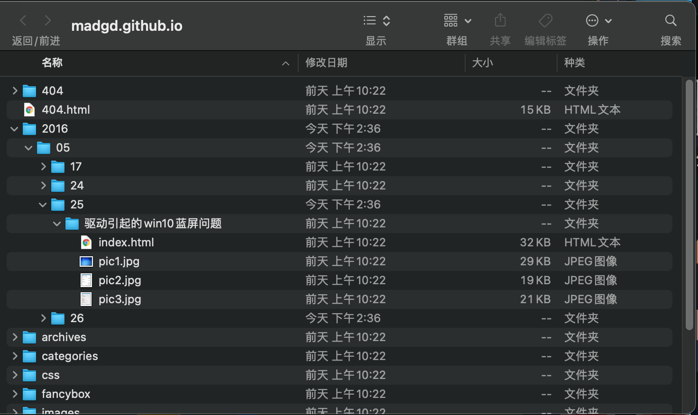

通过检索相关文档，才想起来md等数据是存在原始的hexo的工作目录中的，实际部署的博客目录是生成的`public`文件夹的结果。果断翻出旧硬盘找原始文件。但是只找到了若干md，并没用工作目录。
看来当年还是`too young`。

只能重新搭建hexo的工作目录，在把原来的md更新进去了。

## 1. 安装hexo
互联网上hexo的安装攻略一大把，随便搜一下照着来就行。

>官方的文档有点旧了，谨慎参考：[官方文档](https://hexo.io/zh-cn/docs/)\
参考这位老哥[使用hexo搭建个人博客并部署到GitHub](https://www.jianshu.com/p/282717c8da6c)\
windows环境可参考这位老哥 [GitHub+Hexo 搭建个人网站详细教程](https://zhuanlan.zhihu.com/p/26625249)

mac上比较简单：
```
brew install node
npm install -g hexo-cli
hexo init blog
cd blog && npm install
```
安装完成后验证：
```
hexo s
(hexo server)
```
执行成功后访问`http://localhost:4000`可验证
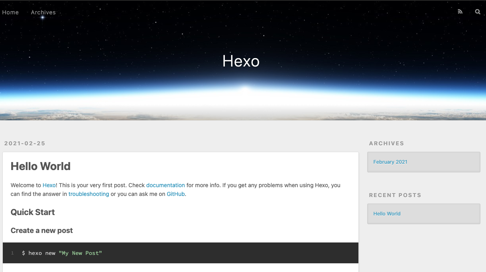

hints:
1. npm速度慢——[切换淘宝源](https://www.jianshu.com/p/63acb38962c6)
2. 运行时，npm提示缺哪个包就`npm install`就行了，有问题对症下药。

做一点站点的基础配置，编辑`_config.yml`:
```
title: madgd's blog
subtitle: ''
description: let's party
keywords:
author: madgd
language: zh
timezone: 'Asia/Shanghai'
```

# 2. 安装next theme
>hexo有大量主题资源，可以浏览并选择自己喜欢的主题安装[theme](https://hexo.io/themes/)

沿用原来使用的theme [next](https://github.com/theme-next/hexo-theme-next)
```
cd blog
git clone https://github.com/theme-next/hexo-theme-next themes/next
```

编辑`_config.yml`
```
theme: next
```
在此`hexo s` 即可看到效果
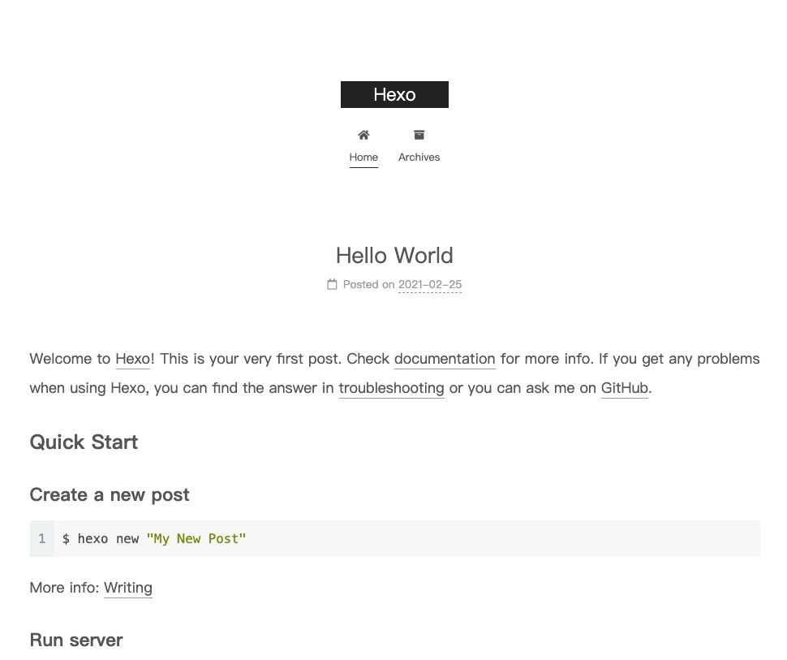
# 3. 恢复原post
将原有post的md移动到`_posts`文件夹中，发现标题，时间不对：

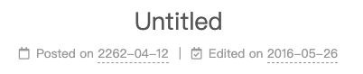

好解决，在md头部添加信息，即可修复标题、时间：
>\-\-\-\
title: test\
date: 2016-05-25 11:18:09\
tags:\
\-\-\-

# 4. 统一图片路径
在`source`下建立`img`目录，将所有图片移入，修改图片链接为相对目录：
```
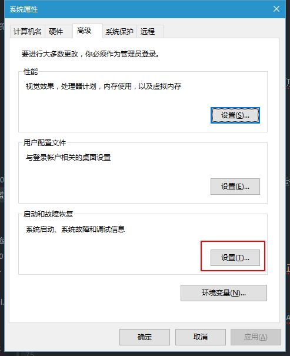
```

**至此原博客工作目录恢复完成，可以开始编辑新的博文了**

如何部署后文再讲

***

# 0x01 部署

官方介绍了多种[一键部署方案](https://hexo.io/zh-cn/docs/one-command-deployment.html), 这里我们使用github pages

# 0. 保留原代码
那么怎么保留hexo的原目录，以防在换电脑时避免文件丢失呢？

最好还是github代码库同步。但如果单独新建代码库，又略显多余。

一种主流方案是通过手动双`branch`实现：
>branch master 作为默认分支，放生成的博客文件\
>branch source 用于保存hexo的工作目录原文件

参考文档：
>[官方](https://hexo.io/zh-cn/docs/one-command-deployment)\
这位老哥的比较[详细](https://www.cnblogs.com/codecheng99/p/12380700.html#%E4%BA%8C%E3%80%81%E5%B0%86hexo%E9%83%A8%E7%BD%B2%E5%88%B0github%E4%B8%8A%E9%9D%A2%EF%BC%8C%E5%AE%9E%E7%8E%B0%E5%8F%8C%E5%88%86%E6%94%AF%E9%83%A8%E7%BD%B2)

另一种是官网推荐的用[Travis CI](https://travis-ci.com/)持续集成的，我们只需要保持hexo工作目录在github上更新即可，继续集成将生成站点目录并推送部署。（其实也可以双分支）
>[持续集成方案](https://hexo.io/zh-cn/docs/github-pages.html)


## 1. 采坑解决
### 1.1 部署报错

在按照[持续集成方案](https://hexo.io/zh-cn/docs/github-pages.html)部署时，

```
fsevents not accessible from chokidar
The command "eval npm ci  " failed. Retrying, 2 of 3.
```

检索该错误，未找到相关信息。检查travis 与本地环境diff，发现node版本不同：
```
node_js:
  - 10 # 官方文档版本
本地：
$ node -v
v15.3.0
```
修改版本一致: `- 15`

并添加`deploy`目录：
```
deploy:
  ...
  target: gh-page
```
### 1.2 修复图片路径错误

通过相对路径法生成的博客图片，在博客首页显示正常，但在博文详情页，缺发生了链接错误的情况。是相对路径导致。已有的主流解决方法参考：
>[hexo博客中插入图片失败——解决思路及个人最终解决办法](https://blog.csdn.net/m0_43401436/article/details/107191688)\
>[Hexo 中完美插入本地图片](https://andavid.github.io/2019/01/15/insert-local-image-in-hexo/)

几种方法或者需要舍弃md在本地图片的显示，或者需要为每篇博文单独建立目录，不利于图片的复用。

这里尝试一种新的思路：
>本地使用相对路径，支持md；再部署时批量去掉路径前的`..`，变成网站绝对目录

这样在本地编辑时，使用相对目录，可正常预览md：
```

```
完成md编辑后，直接push到在github的master分支hexo工作目录，md也可以正常预览。

修改部署脚本`.travis.yml`, 在`hexo g`生成前，使用`sed` 正则匹配所有_post中的md文件, 原地批量替换：
```
sed -i '1,$s/](\.\.\/img/](\/img/g' source/_posts/*.md

```

>在mac上测试的时候会有一点问题，使用`-i`参数的时候会报错，可以试用`gsed`，参考：[mac sed -i 报错](https://www.whidy.net/macos-sed-command-notice)

## 2. 方案总结

总体步骤基本按照官方，需要修改`.travis.yml`. 以下为了方便看，直接复制过来：

1. 新建一个 repository。如果你希望你的站点能通过 `<你的 GitHub 用户名>.github.io` 域名访问，你的 repository 应该直接命名为 `<你的 GitHub 用户名>.github.io`， 如：
```
madgd/madgd.github.io
```
2. 将你的 Hexo 站点文件夹推送到 repository 中。默认情况下不应该`public` 目录将不会被推送到 repository 中，你应该检查 `.gitignore` 文件中是否包含 `public` 一行，如果没有请加上。
```
.DS_Store
Thumbs.db
db.json
*.log
node_modules/
public/
.deploy*/
```
3. 将 [Travis CI](https://github.com/marketplace/travis-ci) 添加到你的 GitHub 账户中。
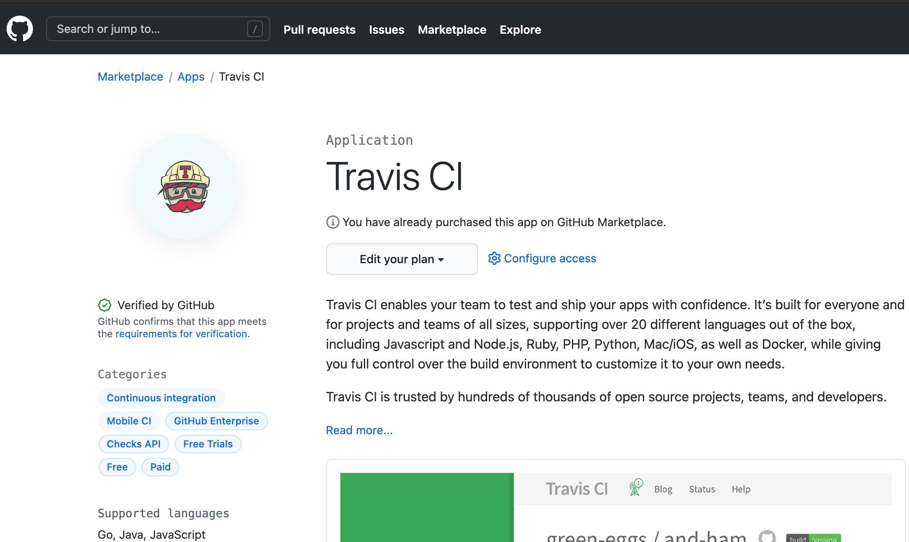
4. 前往 GitHub 的 [Applications settings](https://github.com/settings/installations)，配置 Travis CI 权限，使其能够访问你的 repository。
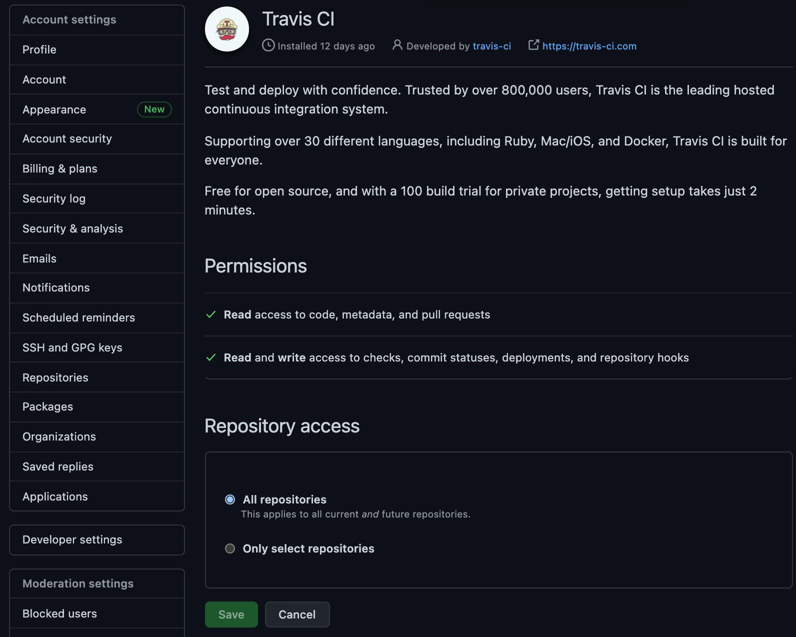
5. 你应该会被重定向到 Travis CI 的页面。如果没有，请 [手动前往](https://travis-ci.com/)。
6. 在浏览器新建一个标签页，前往 GitHub [新建 Personal Access Token](https://github.com/settings/tokens)，只勾选 repo 的权限并生成一个新的 Token。Token 生成后请复制并保存好。
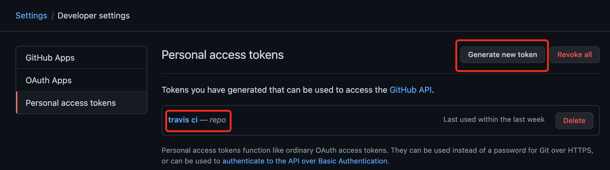
7. 回到 Travis CI，前往你的 repository 的设置页面，在 Environment Variables 下新建一个环境变量，Name 为 GH_TOKEN，Value 为刚才你在 GitHub 生成的 Token。确保 DISPLAY VALUE IN BUILD LOG 保持 不被勾选 避免你的 Token 泄漏。点击 Add 保存。
8. 在你的 Hexo 站点文件夹中新建一个 .travis.yml 文件, 经修改最终生成的`.travis.yml`文件：
```
sudo: false
language: node_js
node_js:
  - 15 # use nodejs v15 LTS
cache: npm
branches:
  only:
    - master # build master branch only
script:
  - sed -i '1,$s/](\.\.\/img/](\/img/g' source/_posts/*.md
  - hexo cl
  - hexo generate # generate static files
deploy:
  provider: pages
  skip-cleanup: true
  github-token: $GH_TOKEN
  keep-history: true
  on:
    branch: master
  local-dir: public
  target: gh-pages
```
9. 将`.travis.yml` 推送到 repository 中。Travis CI 应该会自动开始运行，并将生成的文件推送到同一 repository 下的`gh-pages` 分支下
10. 在 GitHub 中前往你的 repository 的设置页面，修改 `GitHub Pages` 的部署分支为 `gh-pages`。
11. 前往 `https://<你的 GitHub 用户名>.github.io` 查看你的站点是否可以访问。可能需要稍等一会儿。


**这样，每次更新博客的操作就是：**

1. hexo new "title"
2. 编辑md
3. 图片存在`source/img/` 目录下，md中使用相对路径`../img/pic`引入图片，本地可正常预览
4. 写完后
```
git add .
git commit -m "comment"
git push
```
5. 剩下的工作会由`travis`持续集成完成
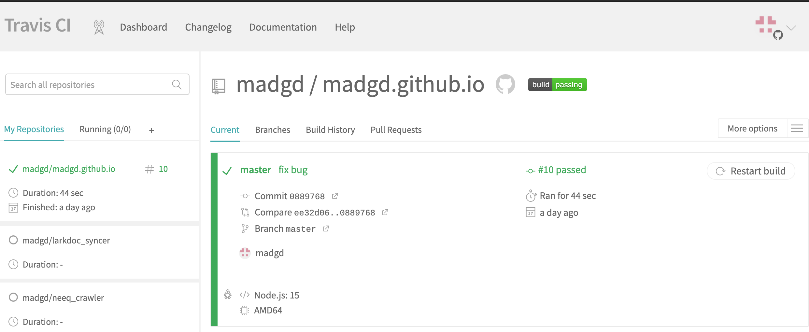

***
# 0x02 装修
## 0. 个性化设置
编辑`.config.yml`:
```
title: madgd's blog
subtitle: ''
description: let's party
keywords:
author: madgd
language: zh
timezone: 'Asia/Shanghai'

```

编辑`themes/next/_config.yml`:
```
scheme: Gemini

# Dark Mode
darkmode: true

language: zh-cn

position: left
# 头像
avatar:
  url: /img/avatar.png

# 显示浏览进度
# Reading progress bar
reading_progress:
  enable: true
  # Available values: top | bottom
  position: top
  color: "#37c6c0"
  height: 3px
```

可参考[next使用](http://theme-next.iissnan.com/getting-started.html)
## 1. 开启百度统计&添加阅读量统计

参考[next使用](http://theme-next.iissnan.com/getting-started.html)相关章节

效果如图：
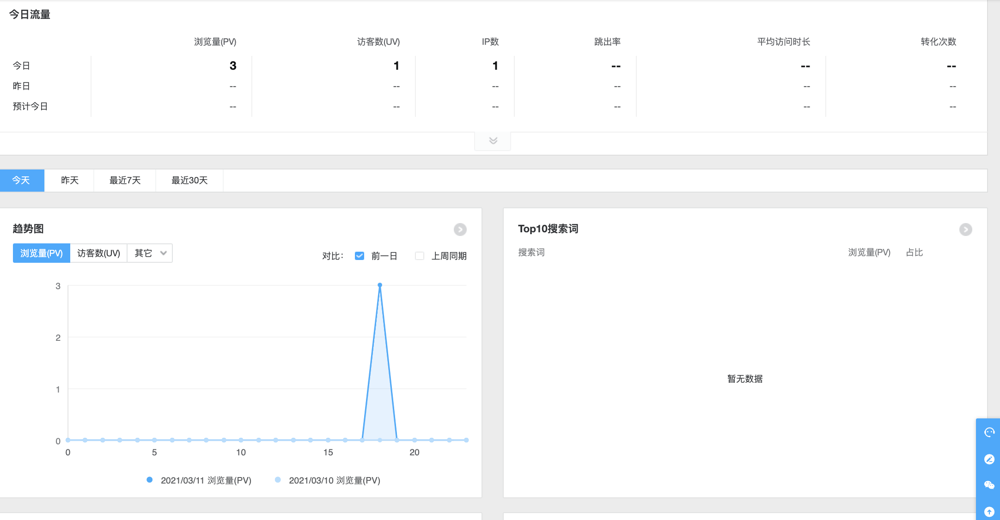

参考[添加文章阅读量统计](https://cloud.tencent.com/developer/article/1482008)

注意，按以上步骤配置后并不会立即生效，会提示：
```
Views: Counter not initialized! More info at console err msg.
```
查看console:
```
ATTENTION! LeanCloud counter has security bug, see how to solve it here: https://github.com/theme-next/hexo-leancloud-counter-security. 
 However, you can still use LeanCloud without security, by setting `security` option to `false`.
```

可直接选择修改配置:
```
  security: false
```

或者按照[hexo-leancloud-counter-security](https://github.com/theme-next/hexo-leancloud-counter-security) 安装并配置

效果如图：
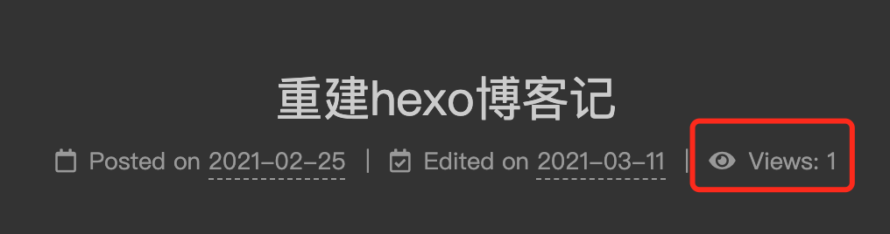

## 2. 引入评论

常用评论模块有：[next评论系统](https://www.zhihu.com/question/267598518)

其中disqus需要翻墙，github类的gitment、gitalk、gitter需要github账号，valine无后端，对用户门槛最低。因此优先接入valine。

### 2.1 valine
参考这位老哥的方案[Hexo博客进阶：为Next主题添加Valine评论系统](https://qianfanguojin.github.io/2019/07/23/Hexo%E5%8D%9A%E5%AE%A2%E8%BF%9B%E9%98%B6%EF%BC%9A%E4%B8%BANext%E4%B8%BB%E9%A2%98%E6%B7%BB%E5%8A%A0Valine%E8%AF%84%E8%AE%BA%E7%B3%BB%E7%BB%9F/)

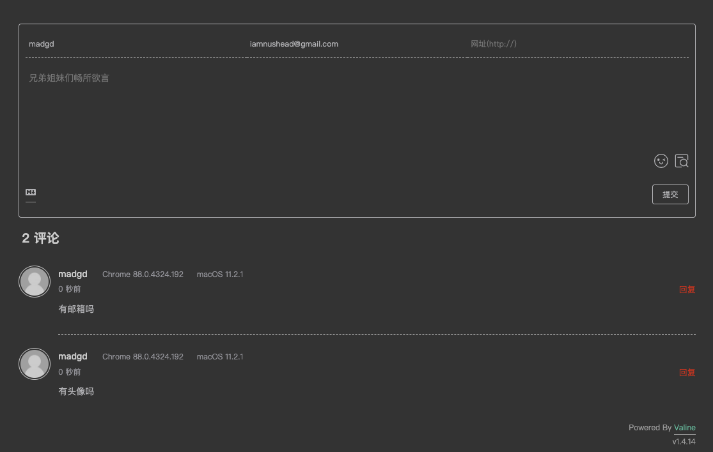

开启新评论[邮件提醒](https://github.com/zhaojun1998/Valine-Admin):
1. 参考以上文档设置leancloud。因leancloud升级，设置页面略有不同，见下图
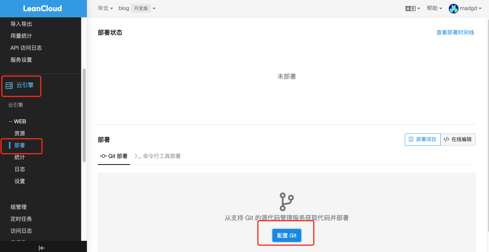
配置结果：
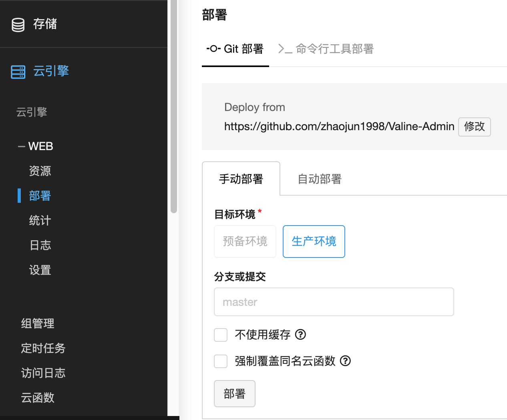
2. 设置休眠策略
可参考以上文档中的休眠策略，按相关内容设置。设置leanCloud自带定时器.
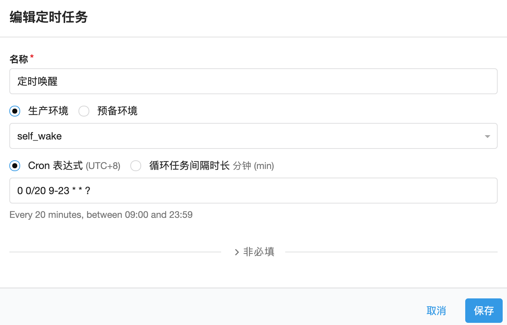

保存完成后，自动启动。可查看日志验证

todo: 利用server酱开启[微信通知](https://blog.csdn.net/sviptzk/article/details/104641949)

### 2.2 livere
同时，为了支持带图片评论，接入[来必力](https://livere.com/), 方案参考这位老哥的[Hexo博客优化之实现来必力评论功能
](https://zhuanlan.zhihu.com/p/33617273)

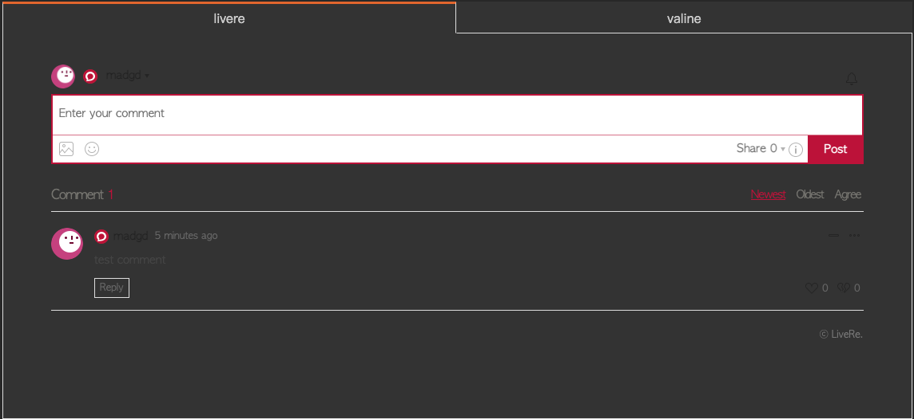

点击头像，`管理页面`，`设置`可选择支持登录的sns，单击开关，拖动可调整顺序（个人认为微信什么的要往前放）:
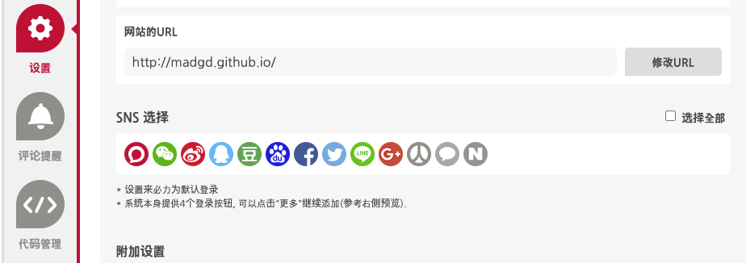

开启新评论邮件提醒：
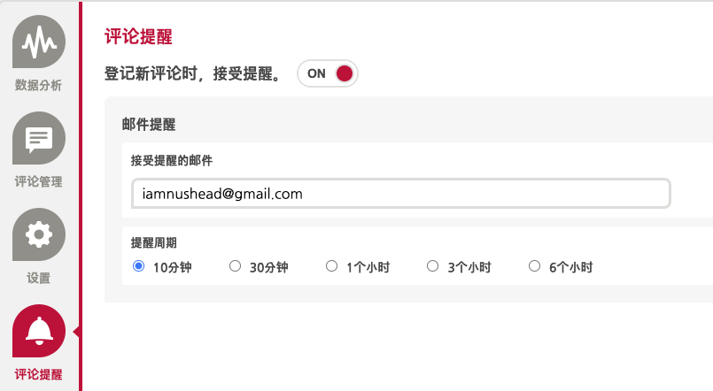

**\*不知道为什么设置完了就是收不到邮件提醒，哪位老哥了解的请评论区告诉我！**

### 2.3 gitalk
再考虑接入支持github登录管理的，参考[gitalk](https://marsgt.github.io/2018/12/29/%E5%9C%A8NexT%E4%B8%BB%E9%A2%98%E4%B8%8B%E6%B7%BB%E5%8A%A0Gitalk%E7%9A%84%E7%AE%80%E5%8D%95%E8%AE%B0%E5%BD%95/):

1. 申请个[GitHub Application](https://github.com/settings/applications/new)，Homepage URL和Authorization callback URL就写成博客地址就行
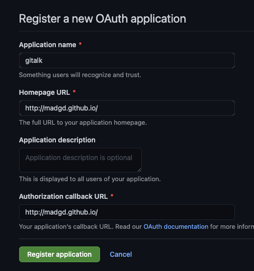
2. 提交后会生成clinet ID，点击`Generate a new client secret`按钮，生成一个client secrets
3. 配置`themes/next/_config.yml`:
```
gitalk:
  enable: true
  github_id: madgd # GitHub repo owner
  repo: madgd.github.io # Repository name to store issues
  client_id:  # GitHub Application Client ID
  client_secret:  # GitHub Application Client Secret
  distraction_free_mode: true # Facebook-like distraction free mode
```
4. 此时会提示`Related Issues not found`，使用自己的github账号第一次登录到新建的博文下的gitalk模块，会自动生成相应的issue。所以养成发文后自己先验证一下效果的习惯即可。当然也可以[使用脚本自动初始化issue](https://cloud.tencent.com/developer/article/1702501)


5. 开启新评论邮件提醒：
在github中点击右上角头像，`Settings`->`Emails`确认邮箱；然后点击`Notifications`，根据自己的需要，调整通知选项即可。在自己的博客项目主页右上角，点击watch即可注意自己的邮箱是否将通知提醒识别为垃圾邮件。`Email notification preferences:`
- [x] Comments on Issues and Pull Requests 


### 2.4 disqus
也试下主流的disqus，参考[hexo开启disqus](https://titangene.github.io/article/hexo-disqus.html):
1. 申请disqus账号
2. 配置`themes/next/_config.yml`:
```
disqus:
  enable: true
  shortname: your_disqus_short_name
  count: true
```
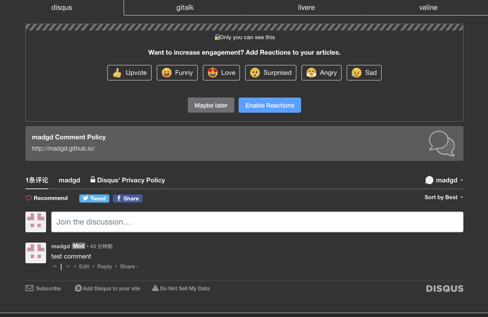

3. 开启新评论邮件提醒

[disqus help](https://help.disqus.com/en/articles/1717254-troubleshooting-email-notifications)

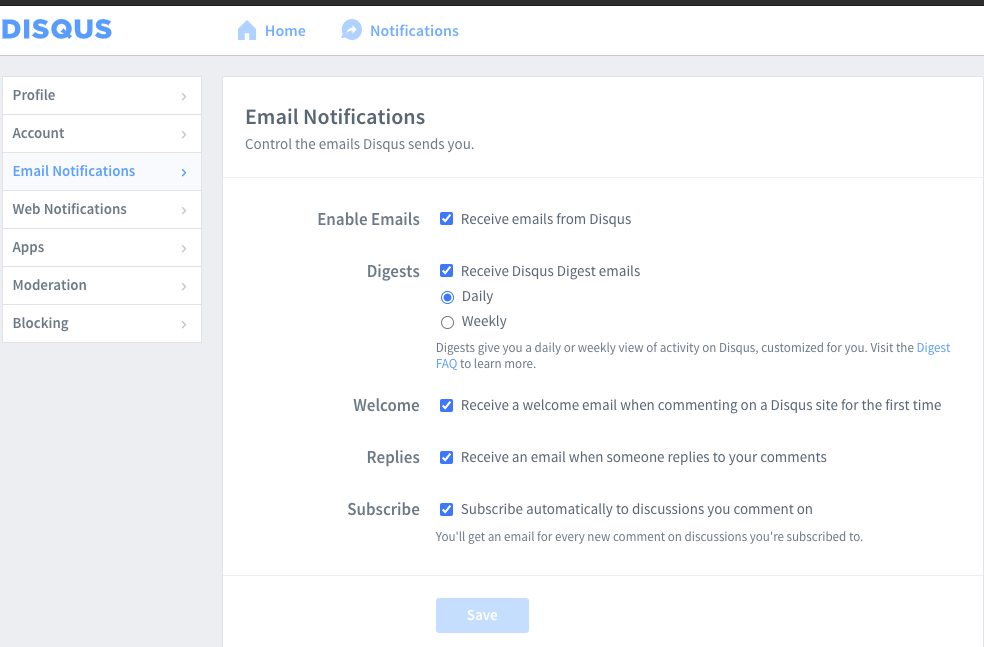

**\*不知道为什么设置完了就是收不到邮件提醒，哪位老哥了解的请评论区告诉我！**

### 2.5 调整评论模块的展示
`themes/next/_config.yml`：
```
comments:
  # Available values: tabs | buttons
  style: buttons
  # Choose a comment system to be displayed by default.
  # Available values: changyan | disqus | disqusjs | gitalk | livere | valine
  active: gitalk
  # Setting `true` means remembering the comment system selected by the visitor.
  storage: true
  # Lazyload all comment systems.
  lazyload: true
  # Modify texts or order for any navs, here are some examples.
  nav:
    gitalk:
     order: -1
    disqus:
     text: disqus
     order: -2
```

## 3. 添加fork me on github
文件位置：\themes\next\layout\_layout.swig，在<div class="headband"></div>下一行添加如下代码。
```
<a href="https://www.github.com/madgd" class="github-corner" aria-label="View source on Github"><svg width="80" height="80" viewBox="0 0 250 250" style="fill:#151513; color:#fff; position: absolute; top: 0; border: 0; right: 0;" aria-hidden="true"><path d="M0,0 L115,115 L130,115 L142,142 L250,250 L250,0 Z"></path><path d="M128.3,109.0 C113.8,99.7 119.0,89.6 119.0,89.6 C122.0,82.7 120.5,78.6 120.5,78.6 C119.2,72.0 123.4,76.3 123.4,76.3 C127.3,80.9 125.5,87.3 125.5,87.3 C122.9,97.6 130.6,101.9 134.4,103.2" fill="currentColor" style="transform-origin: 130px 106px;" class="octo-arm"></path><path d="M115.0,115.0 C114.9,115.1 118.7,116.5 119.8,115.4 L133.7,101.6 C136.9,99.2 139.9,98.4 142.2,98.6 C133.8,88.0 127.5,74.4 143.8,58.0 C148.5,53.4 154.0,51.2 159.7,51.0 C160.3,49.4 163.2,43.6 171.4,40.1 C171.4,40.1 176.1,42.5 178.8,56.2 C183.1,58.6 187.2,61.8 190.9,65.4 C194.5,69.0 197.7,73.2 200.1,77.6 C213.8,80.2 216.3,84.9 216.3,84.9 C212.7,93.1 206.9,96.0 205.4,96.6 C205.1,102.4 203.0,107.8 198.3,112.5 C181.9,128.9 168.3,122.5 157.7,114.1 C157.9,116.9 156.7,120.9 152.7,124.9 L141.0,136.5 C139.8,137.7 141.6,141.9 141.8,141.8 Z" fill="currentColor" class="octo-body"></path></svg></a><style>.github-corner:hover .octo-arm{animation:octocat-wave 560ms ease-in-out}@keyframes octocat-wave{0%,100%{transform:rotate(0)}20%,60%{transform:rotate(-25deg)}40%,80%{transform:rotate(10deg)}}@media (max-width:500px){.github-corner:hover .octo-arm{animation:none}.github-corner .octo-arm{animation:octocat-wave 560ms ease-in-out}}</style>
```

## 4. 引入搜索服务
添加[local search](https://theme-next.iissnan.com/third-party-services.html#local-search)

## 5. 添加网易云音乐
参考这位老哥[添加网易云音乐](https://vincentqin.tech/posts/build-a-website-using-hexo/)

<center><iframe frameborder="no" border="0" marginwidth="0" marginheight="0" width=330 height=86 src="//music.163.com/outchain/player?type=2&id=20282679&auto=1&height=66"></iframe></center>

## 6. 添加分享
[参考](https://theme-next.iissnan.com/third-party-services.html#share-addthis)

注册完成后，点击右上角`Get The Code`，获取`pubid=`后面的id，修改配置
```
add_this_id: ***
```

点击左上角`Tools`，可设置分享样式。

## 7. 首页不显示文章全文
[参考](https://ninesix.cc/post/hexo-yilia-auto-excerpt.html)
安装`hexo-excerpt`:
```
npm install -save hexo-excerpt
```
**注意`hexo-auto-excerpt`已失效**

编辑`_config.yml`:
```
excerpt:
  depth: 7
  excerpt_excludes: []
  more_excludes: []
  hideWholePostExcerpts: true
```

可以通过在博文中任意想截取的地方添加```<!-- more -->```完成自定义长度的摘要。这样在本标识之前的就为博文摘要。

## 8. 添加字数统计/阅读时长
参考[Hexo博客NexT主题下添加字数统计和阅读时长](https://www.himmy.cn/2019/07/06/hexo%E5%8D%9A%E5%AE%A2next%E4%B8%BB%E9%A2%98%E4%B8%8B%E6%B7%BB%E5%8A%A0%E5%AD%97%E6%95%B0%E7%BB%9F%E8%AE%A1%E5%92%8C%E9%98%85%E8%AF%BB%E6%97%B6%E9%95%BF/)

next主题已支持`hexo-symbols-count-time`,使用该方案。

安装：
```
npm install --save hexo-symbols-count-time
```
修改`_config.yml`：
```
# symbols_count_time
symbols_count_time:
  symbols: true
  time: true
  total_symbols: true
  total_time: true
  exclude_codeblock: false
```

`themes/next/_config.yml`：
```
symbols_count_time:
  separated_meta: true     # 是否另起一行（true的话不和发表时间等同一行）
  item_text_post: true     # 首页文章统计数量前是否显示文字描述（本文字数、阅读时长）
  item_text_total: false   # 页面底部统计数量前是否显示文字描述（站点总字数、站点阅读时长）
  awl: 4                   # Average Word Length
  wpm: 275                 # Words Per Minute（每分钟阅读词数）
  suffix: mins.
```

## 9. 添加“关于”标签
参考这位老哥[https://zhuanlan.zhihu.com/p/94038688](https://zhuanlan.zhihu.com/p/94038688)

## 8. 添加google ad
[在 NexT 主题中接入 Google AdSense](https://www.boris1993.com/others/hexo-next-enable-google-adsense.html)