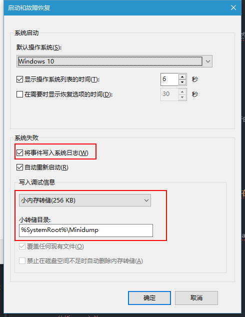

这是一个悲伤的故事

## 0x00 问题

>**症状分析**：windows10每隔20分钟左右就蓝屏崩溃，错误信息为：***critical_structure_corruption***

>**起始情况**：当时我正在正常使用，系统突然自动关机，之后就开始不断蓝屏

了解清楚基本情况后，决定先使用通常方法尝试解决

***

## 0x01 开始

使用搜索引擎查询，得到[解决指导1](http://www.xitongcheng.com/jiaocheng/win10_article_13907.html)

考虑重装系统软件和环境重新配置比较麻烦，所以总结除去重装系统之外的解决方法有：

>1. 可能由硬件错误导致，所以检察 **主板 内存 硬盘** 等硬件插口
>2. 系统还原
>3. 删除近期安装的软硬件及其驱动
>4. 检测安全软件是否有冲突
>5. 更新官方的稳定驱动
>6. 使用 `SFC /scannow` 命令修复系统
>7. 分析[Dump文件](http://jingyan.baidu.com/article/8275fc868d277e46a03cf6d4.html)
>8. 重置系统(不需要系统启动盘，可自行重新安装并保留原文件，但会删除所有软件)

### 1. 硬件原因

对接口进行清理并重新安装硬件，蓝屏依旧

### 2. 系统还原

升级windows10后竟然没有设置系统还原，此路不通。

**教训: 开启系统还原的重要**

### 3. 近期安装的软硬件

近期没有更新硬件，所以在 `控制面板-->程序和功能` 中按时间排序，删除所有近期安装的软件。仍然没有效果。

### 4. 安全软件冲突

一直只使用MSE，并没有这个问题。

### 5. 更新官方驱动

分别尝试用 **驱动精灵** 和 **设备管理器** 更新驱动并重启， 仍然出现相同错误的蓝屏。

### 6. 使用`SFC /scannow`命令

在CMD管理员权限执行后，检测系统完整度100%，完成修复。然而仍然蓝屏。

当然也有可能像这里的盆友[这样](http://bbs.pcbeta.com/viewthread-1625971-2-1.html)，在`C:\Windows\Logs\CBS`查看CBS.log日志，找到对应的问题。虽然这里我没有找到。

**ps**: 软媒魔方的系统修复工具就是使用`SFC /scannow`命令

***

## 0x02 转机

　　在尝试以上办法无效后，心情很无奈。 然而在一次系统正常运行时，弹出了3个ie的窗口，内容比较劲爆。意识到自己可能无意中**中毒**了。

　　有没有可能是这个原因导致的蓝屏呢？情况有转机！

+ **新思路：进行全盘扫描杀毒: **

　　　安装Avast并进行全盘杀毒和开机启动杀毒。过程很漫长。正在杀完毒要启动系统时，又蓝屏了。

　　　**方法失败**

**ps**: 小A扫描之后确实再没有弹出过ie广告窗口，至少证明**Avast**比**MSE**还是好些

***

## 0x03 继续

然后开始了漫长的dump文件分析

### 7. 分析Dump文件

1. 调整设置，使系统在蓝屏时生成minidump文件
>系统--高级系统设置--高级--启动和故障恢复--写人调试信息(选择小内存转储)

  

  
2. 分析dump文件

  　**分析方法参考[分析dump文件](http://jingyan.baidu.com/article/8275fc868d277e46a03cf6d4.html)**

  　分析结果是`0x109`错误 附加信息`1c` 定位为驱动错误, 详情看[msdn](https://msdn.microsoft.com/en-us/library/windows/hardware/ff557228%28v=vs.85%29.aspx)

3. 驱动压力测试——找到不稳定驱动并排查问题

  　**参考[驱动压力测试](http://answers.microsoft.com/en-us/windows/wiki/windows_10-update/driver-verifier-tracking-down-a-mis-behaving/f5cb4faf-556b-4b6d-95b3-c48669e4c983)**

  　用`Verifier`开启测试后，启动阶段会不断蓝屏并生成`dump`文件，进入安全模式，使用`Verifier /reset`可以关闭测试。然后正常启动并用软件分析dump文件，找到错误的驱动来源。

  | 错误信息      |    对应的驱动 |
  | :-------- | --------:|
  | critical_structure_corruption(Bugcheck 0x109)  | kavbootc64.sys |
  | critical_structure_corruption(Bugcheck 0x109)     |   kavbootc.sys|
  | critical_structure_corruption(Bugcheck 0x109)      |    vmci.sys |
  | critical_structure_corruption(Bugcheck 0x109) | aswVmm.sys|
  | critical_structure_corruption(Bugcheck c4) | bocomkeyflt.sys|
  | critical_structure_corruption(Bugcheck 0x109) | atikmpag.sys(105c)|

  　　　相继删除还排除了以上驱动后，卡在了`atikmpag.sys`。无论怎么更新该驱动，总会蓝屏。又用别的正常电脑运行驱动测试，也会出现蓝屏。 这次真的无力了。在花费了大量时间之后，只能放弃这种方法。

  **结论: 很难找到引发蓝屏的错误**

## 0x04 终结

### 8. 重置系统

这个不用多说了，选择保留文件就行。注意提前保存一下重要的文件。

重置后安装驱动，配置环境，再没有出现蓝屏现象。

欢迎大家和我交流。
